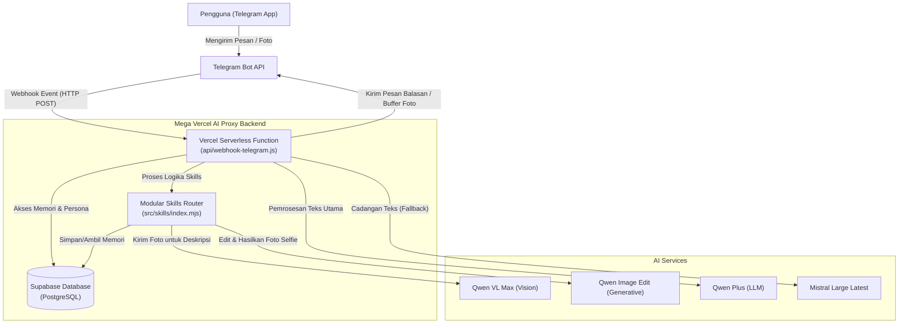
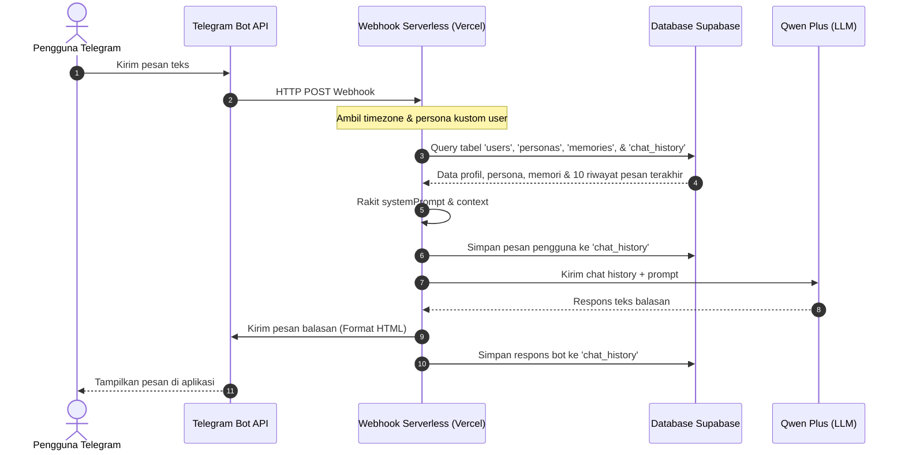

# Dokumentasi Lengkap & Arsitektur Chatbot Airish

Airish adalah chatbot berbasis AI Companion interaktif yang diintegrasikan dengan platform **Telegram**. Airish dirancang agar memiliki kepribadian (persona) yang sangat natural layaknya teman mengobrol di WhatsApp, dilengkapi dengan kemampuan ingatan jangka panjang (Long-term Memory), pemahaman visual (Vision AI), serta pembuatan foto kustom yang konsisten secara identitas (Image Generation).

Dokumen ini menjelaskan arsitektur teknis, aliran data, komponen utama, dan skema database dari chatbot Airish.

---

## 1. Arsitektur Sistem

Chatbot Airish berjalan di atas arsitektur serverless modern berbasis event-driven. Berikut adalah diagram arsitektur tingkat tinggi dari sistem Airish:



### Komponen Utama Arsitektur:
1. **Telegram Client & Bot API**: Antarmuka utama interaksi pengguna. Event chat dikirim ke webhook backend.
2. **Vercel Serverless Function (`api/webhook-telegram.js`)**: Endpoint webhook utama yang memproses payload dari Telegram, mengelola flow fallback LLM, serta memicu eksekusi skill yang relevan.
3. **Supabase Database (PostgreSQL)**: Berfungsi sebagai penyimpanan data persisten untuk histori chat, informasi pengguna (timezone), fakta memori jangka panjang, data persona kustom, dan pencatatan log sistem.
4. **Skills Router (`src/skills/index.mjs`)**: Router modular yang memetakan pemanggilan fungsi (tool call) dari LLM ke sub-modul fungsional spesifik seperti Memory and Photo.
5. **AI Services**:
   - **Qwen Plus**: Model LLM utama untuk percakapan teks sehari-hari dan penentuan pemanggilan tool (function calling).
   - **Mistral Large**: Model LLM cadangan apabila API Qwen Plus mengalami gangguan.
   - **Qwen-VL-Max**: Model Vision AI untuk menganalisis dan mendeskripsikan foto yang dikirimkan oleh pengguna.
   - **Qwen Image Edit**: Model Image Generation yang menggunakan foto referensi (`airish.jpg`) untuk menghasilkan foto/selfie baru sesuai deskripsi pengguna dengan menjaga konsistensi wajah.

---

## 2. Aliran Data (Data Flow)

### A. Aliran Pemrosesan Pesan Teks


### B. Aliran Pemrosesan Foto (Vision AI)
Ketika pengguna mengirimkan foto, Airish mendeskripsikan foto tersebut terlebih dahulu menggunakan Vision AI sebelum merespons:
1. Pengguna mengirimkan foto melalui Telegram.
2. Webhook mendeteksi adanya payload `photo`.
3. Backend mengunduh berkas gambar dengan resolusi tertinggi dari server Telegram.
4. Gambar dikonversi ke format **Base64**.
5. Backend mengirimkan Base64 tersebut ke **Qwen-VL-Max** dengan instruksi untuk mendeskripsikan foto dalam 2-3 kalimat bahasa Indonesia.
6. Hasil deskripsi disisipkan sebagai konteks teks tambahan bagi LLM dengan format: `[Pengguna mengirim foto: <deskripsi_foto>]. <pesan_teks_pengguna>`.
7. LLM memproses pesan tersebut seolah-olah ia bisa melihat foto yang dikirimkan.

---

## 3. Sistem Berbasis Keterampilan (Modular Skills)

Airish menggunakan sistem keahlian (Skills) berbasis **Function Calling** dari LLM. Keahlian ini diorganisasikan di dalam folder `src/skills/`.

### A. Skill Foto (`src/skills/photo.mjs`)
Dipicu ketika pengguna meminta foto, selfie, "pap", atau menanyakan penampilan fisik Airish.
* **Tool Name**: `generate_photo`
* **Cara Kerja**:
  1. LLM menerjemahkan permintaan pengguna menjadi prompt deskriptif dalam bahasa Inggris (misalnya: *"A full body mirror selfie of this person"*).
  2. Fungsi `executePhotoTool` memicu aksi Telegram `upload_photo` dan menampilkan pesan tunggu *"Bentar ya, aku fotokan dulu... 📸"*.
  3. Mengirimkan prompt dan gambar referensi wajah Airish (`airish.jpg`) ke API **Qwen Image Edit** untuk menjaga kemiripan wajah.
  4. Unduh berkas gambar hasil generator ke memori backend sebagai buffer.
  5. Kirim gambar tersebut ke Telegram menggunakan format multipart/form-data.

### B. Skill Memori (`src/skills/memory.mjs`)
Dipicu secara otomatis oleh LLM ketika pengguna membagikan informasi penting mengenai dirinya (nama, ulang tahun, hobi, dsb.).
* **Tool Name**: `save_memory`
* **Cara Kerja**:
  1. LLM menangkap fakta penting dan mengekstrak tanggal jika ada.
  2. Fungsi `executeMemoryTool` memasukkan data tersebut ke tabel `memories`.
  3. Backend memicu kembali LLM dengan status eksekusi tool sukses agar LLM dapat membalas percakapan dengan natural (contoh: *"Fakta itu sudah aku ingat ya!"*).

---

## 4. Skema Database Supabase

Sistem menggunakan database PostgreSQL dari Supabase untuk menyimpan status percakapan dan kepribadian. Berikut rincian tabelnya:

### 1. Tabel `users`
Menyimpan data dasar pengguna Telegram.
```sql
CREATE TABLE users (
    telegram_id BIGINT PRIMARY KEY,
    timezone VARCHAR(50) DEFAULT 'Asia/Jakarta',
    created_at TIMESTAMP WITH TIME ZONE DEFAULT CURRENT_TIMESTAMP
);
```

### 2. Tabel `personas`
Menyimpan konfigurasi kepribadian Airish yang bisa disesuaikan untuk masing-masing pengguna.
```sql
CREATE TABLE personas (
    telegram_id BIGINT PRIMARY KEY REFERENCES users(telegram_id),
    name VARCHAR(100) NOT NULL,
    archetype TEXT,
    craft TEXT,
    backstory TEXT,
    world_context TEXT,
    reference_image_url TEXT,
    created_at TIMESTAMP WITH TIME ZONE DEFAULT CURRENT_TIMESTAMP
);
```

### 3. Tabel `chat_history`
Menyimpan riwayat obrolan jangka pendek (dibatasi 10 pesan terakhir saat dikirim ke LLM).
```sql
CREATE TABLE chat_history (
    id BIGSERIAL PRIMARY KEY,
    telegram_id BIGINT REFERENCES users(telegram_id),
    role VARCHAR(20) NOT NULL, -- 'user' atau 'assistant'
    content TEXT NOT NULL,
    created_at TIMESTAMP WITH TIME ZONE DEFAULT CURRENT_TIMESTAMP
);
```

### 4. Tabel `memories`
Menyimpan fakta penting jangka panjang tentang pengguna.
```sql
CREATE TABLE memories (
    id BIGSERIAL PRIMARY KEY,
    telegram_id BIGINT REFERENCES users(telegram_id),
    fact TEXT NOT NULL,
    event_date DATE,
    created_at TIMESTAMP WITH TIME ZONE DEFAULT CURRENT_TIMESTAMP
);
```

### 5. Tabel `bot_logs`
Menyimpan riwayat log aktivitas bot dan error tracking.
```sql
CREATE TABLE bot_logs (
    id BIGSERIAL PRIMARY KEY,
    level VARCHAR(10) NOT NULL, -- 'INFO', 'WARN', 'ERROR'
    event VARCHAR(100) NOT NULL,
    details TEXT,
    telegram_id BIGINT,
    created_at TIMESTAMP WITH TIME ZONE DEFAULT CURRENT_TIMESTAMP
);
```

---

## 5. Model AI & Mekanisme Fallback

Sistem percakapan Airish menerapkan arsitektur toleransi kesalahan (fault-tolerance) menggunakan sistem cadangan bertingkat (fallback):

1. **Model Utama (Qwen Plus)**: Model teks multi-fungsi buatan Alibaba Cloud. Memiliki performa penalaran yang baik serta mendukung function calling secara akurat.
2. **Model Cadangan (Mistral Large)**: Jika API Qwen mengalami kegagalan (misalnya rate limit atau error 5xx), fungsi `queryLLMWithFallback` secara otomatis mendeteksi kegagalan tersebut melalui blok `try-catch`, menulis log peringatan ke database, lalu mengalihkan permintaan pengguna ke **Mistral Large** agar chatbot tetap responsif.

---

## 6. Konfigurasi Environment Variables

Untuk menjalankan chatbot Airish, variabel-variabel lingkungan berikut wajib dikonfigurasi pada environment Vercel:

| Variabel | Deskripsi | Wajib / Opsional |
| --- | --- | --- |
| `TELEGRAM_BOT_TOKEN` | Token resmi bot Telegram dari @BotFather. | **Wajib** |
| `TELEGRAM_WEBHOOK_SECRET` | Token rahasia pengaman webhook Telegram. | Opsional |
| `SUPABASE_URL` | Endpoint API project Supabase Anda. | **Wajib** |
| `SUPABASE_ANON_KEY` | Anon Key untuk autentikasi Supabase. | **Wajib** |
| `QWEN_API_KEY` | Kunci API DashScope Alibaba Cloud. | **Wajib** |
| `MISTRAL_API_URL` | URL Endpoint API Mistral (atau proxy). | Opsional |
| `MISTRAL_API_KEY` | Kunci API Mistral untuk fallback. | Opsional |

---

## 7. Struktur File Terkait Chatbot

Berikut adalah bagian dari pohon direktori proyek yang berkaitan langsung dengan chatbot Airish:

```text
mega-vercel-ai-proxy/
├── api/
│   └── webhook-telegram.js   # Endpoint webhook Telegram utama (Controller)
├── src/
│   ├── skills/               # Modul keahlian (Skills/Tools)
│   │   ├── index.mjs         # Router & daftar definisi tool
│   │   ├── memory.mjs        # Logika penyimpanan memori user
│   │   ├── photo.mjs         # Logika generator selfie & upload foto
│   │   └── vision.mjs        # Logika analisis gambar (Qwen-VL-Max)
│   └── telegram.mjs          # Modul helper interaksi Telegram API
```
